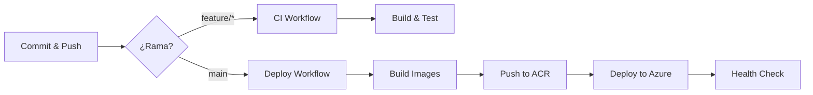

# PhotosMarket - GitHub Actions CI/CD

Este directorio contiene la configuración de GitHub Actions para el despliegue continuo de PhotosMarket.

## 📁 Archivos

### Workflows

- **`ci.yml`** - Integración Continua (builds y tests en PRs)
- **`deploy-backend.yml`** - Despliegue del backend
- **`deploy-frontend.yml`** - Despliegue del frontend
- **`deploy-infra.yml`** - Despliegue de infraestructura
- **`full-deploy.yml`** - Despliegue completo (recomendado)

### Documentación

- **`QUICK_START.md`** - Guía rápida de configuración (5 pasos)
- **`GITHUB_ACTIONS_SETUP.md`** - Documentación detallada

## 🚀 Inicio Rápido

### Opción 1: Script Automatizado (Recomendado)

```powershell
# Ejecutar desde la raíz del proyecto
.\scripts\setup-github-actions.ps1
```

Este script:
- ✅ Crea el Service Principal automáticamente
- ✅ Asigna permisos al Container Registry
- ✅ Genera JWT Secret Key
- ✅ Copia credenciales al portapapeles
- ✅ Guarda toda la información en un archivo

### Opción 2: Manual

Sigue la guía en [`QUICK_START.md`](QUICK_START.md)

## 📋 Secrets Requeridos

Configura estos secrets en GitHub (`Settings → Secrets and variables → Actions`):

| Secret | Descripción |
|--------|-------------|
| `AZURE_CREDENTIALS` | JSON del Service Principal |
| `GOOGLE_OAUTH_CLIENT_ID` | Client ID de Google OAuth |
| `GOOGLE_OAUTH_CLIENT_SECRET` | Client Secret de Google OAuth |
| `JWT_SECRET_KEY` | Clave secreta para JWT (min. 32 caracteres) |
| `GOOGLE_DRIVE_ROOT_FOLDER_ID` | ID de la carpeta raíz de Google Drive |

## 🔄 Flujo de Trabajo



## 🎯 Estrategia de Branching

```bash
main                # Producción - deploys automáticos
├── develop         # Desarrollo - sin deploy
├── feature/*       # Features - CI only
└── hotfix/*        # Fixes urgentes - merge a main para deploy
```

## 📊 Estado de Workflows

Los badges de estado aparecerán aquí una vez que configures los workflows:


## 🛠️ Comandos Útiles

### Ver todos los workflows
```bash
gh workflow list
```

### Ejecutar manualmente
```bash
gh workflow run "Full Deploy to Azure"
```

### Ver logs de última ejecución
```bash
gh run view --log
```

### Ver estado de deployments
```bash
az containerapp list \
  --resource-group rg-photosmarket-dev \
  --query "[].{Name:name, Status:properties.runningStatus}" \
  -o table
```

## 🔐 Seguridad

- Los secrets están encriptados en GitHub
- El Service Principal tiene acceso limitado solo a `rg-photosmarket-dev`
- Las credenciales NUNCA se exponen en logs
- Usa `@secure()` en parámetros sensibles de Bicep

## 📝 Personalización

### Cambiar a múltiples environments

```yaml
# Ejemplo para staging
env:
  AZURE_RESOURCE_GROUP: rg-photosmarket-staging
  BACKEND_CONTAINER_APP: photosmarket-backend-staging
```

### Agregar notificaciones

```yaml
- name: Notify Slack
  uses: slackapi/slack-github-action@v1
  with:
    webhook-url: ${{ secrets.SLACK_WEBHOOK }}
```

## 🐛 Troubleshooting

### Workflow falla en "Log in to Azure"
→ Verifica que `AZURE_CREDENTIALS` sea el JSON completo del Service Principal

### Error "unauthorized to access repository"
→ Ejecuta: `.\scripts\setup-github-actions.ps1` de nuevo para asignar permisos

### Container App no se actualiza
→ Verifica los logs:
```bash
az containerapp logs show \
  --name photosmarket-backend-dev \
  --resource-group rg-photosmarket-dev \
  --follow
```

## 📚 Recursos

- [Documentación completa](GITHUB_ACTIONS_SETUP.md)
- [Guía rápida](QUICK_START.md)
- [GitHub Actions Docs](https://docs.github.com/en/actions)
- [Azure Container Apps CI/CD](https://learn.microsoft.com/en-us/azure/container-apps/github-actions)

## ✅ Checklist de Configuración

- [ ] Service Principal creado
- [ ] 5 secrets configurados en GitHub
- [ ] Permisos de ACR asignados
- [ ] Workflows committeados y pusheados
- [ ] Primer deployment exitoso
- [ ] URLs de producción verificadas

## 🎉 ¡Listo!

Una vez configurado, cada push a `main` desplegará automáticamente tu aplicación a Azure.

**Próximos commits activarán los workflows automáticamente** 🚀
